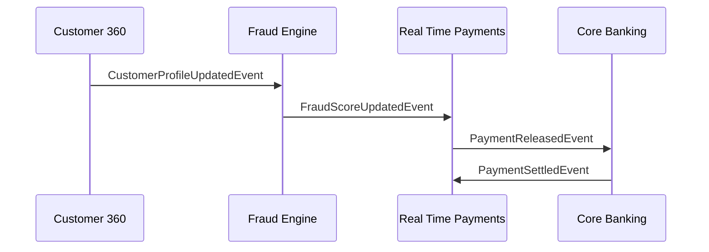
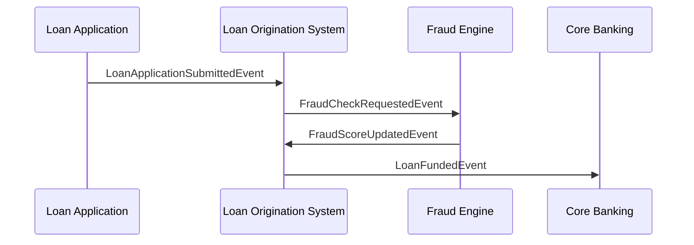

# Enterprise Event Taxonomy for Banking Modernization

## 1. Introduction

This document defines the enterprise-wide event taxonomy used across Customer 360, Fraud and AML, Loan Origination, Real-Time Payments, and Core Banking.  
It establishes a unified, canonical event model that enables interoperability, real-time analytics, and event-driven orchestration across all banking domains.

---

## 2. Event Naming Standards

### 2.1 Naming Convention
```
<Domain><Entity><Action>Event
```

Examples:
- CustomerProfileUpdatedEvent  
- PaymentInitiatedEvent  
- FraudAlertRaisedEvent  
- LoanApplicationSubmittedEvent  
- AccountCreatedEvent  

### 2.2 Event Categories
- Business Events  
- Risk Events  
- Lifecycle Events  
- System Events  

---

## 3. Canonical Event List

### 3.1 Customer 360 Events
| Event | Description |
|-------|-------------|
| CustomerProfileUpdatedEvent | Customer data updated |
| CustomerIdentityVerifiedEvent | KYC verification completed |
| CustomerRiskScoreUpdatedEvent | Risk score recalculated |
| CustomerRelationshipCreatedEvent | New relationship established |

### 3.2 Fraud and AML Events
| Event | Description |
|-------|-------------|
| FraudAlertRaisedEvent | Fraud engine flags a transaction |
| FraudScoreUpdatedEvent | Real-time risk score generated |
| AMLScreeningCompletedEvent | Sanctions/AML checks completed |
| CaseCreatedEvent | Case management workflow triggered |

### 3.3 Real-Time Payments Events
| Event | Description |
|-------|-------------|
| PaymentInitiatedEvent | Payment request received |
| PaymentValidatedEvent | Validation completed |
| FundsAvailabilityCheckedEvent | Balance check performed |
| PaymentReleasedEvent | Payment sent to RTP or FedNow |
| PaymentSettledEvent | Settlement confirmed |
| PaymentFailedEvent | Payment rejected or timed out |

### 3.4 Loan Origination Events
| Event | Description |
|-------|-------------|
| LoanApplicationSubmittedEvent | Application received |
| CreditDecisionGeneratedEvent | Automated decision created |
| DocumentVerifiedEvent | OCR/verification completed |
| UnderwritingCompletedEvent | Manual underwriting done |
| LoanApprovedEvent | Final approval |
| LoanFundedEvent | Funds disbursed |

### 3.5 Core Banking Events
| Event | Description |
|-------|-------------|
| AccountCreatedEvent | New account opened |
| AccountUpdatedEvent | Account attributes changed |
| LedgerPostedEvent | Debit or credit posted |
| BalanceUpdatedEvent | Balance recalculated |

---

## 4. Canonical Event Schema

### 4.1 Standard Envelope

```json
{
  "eventId": "UUID",
  "eventType": "string",
  "eventTimestamp": "ISO-8601",
  "correlationId": "string",
  "sourceSystem": "string",
  "payloadVersion": "v1",
  "payload": {}
}
```

### 4.2 Example Payload (PaymentInitiatedEvent)

```json
{
  "transactionId": "string",
  "customerId": "string",
  "amount": 125.50,
  "currency": "USD",
  "channel": "Mobile",
  "destinationBank": "string",
  "paymentType": "RTP"
}
```

---

## 5. Producer–Consumer Matrix

| Event | Producer | Consumers |
|-------|----------|-----------|
| CustomerProfileUpdatedEvent | Customer 360 | Fraud, LOS, RTP |
| FraudAlertRaisedEvent | Fraud Engine | RTP, Core Banking, Case Mgmt |
| PaymentInitiatedEvent | RTP | Fraud, Core Banking, Analytics |
| LoanApplicationSubmittedEvent | LOS | Fraud, C360, Underwriting |
| AccountCreatedEvent | Core Banking | C360, Analytics, LOS |

---

## 6. Event Flow Examples

### 6.1 Customer → Fraud → RTP Flow



### 6.2 Loan Origination Flow



---

## 7. Event Governance

### 7.1 Governance Principles
- Schema registry required  
- Backward compatibility enforced  
- Versioning required for payload changes  
- PII must be tokenized  
- All events logged for audit  

### 7.2 Ownership Model
- Each domain owns its events  
- Shared events governed by enterprise architecture  
- Changes require cross-domain review  

---

## 8. Summary

This event taxonomy provides a unified, enterprise-wide event model that powers all modernization use cases. It ensures consistency, interoperability, and real-time integration across Customer 360, Fraud and AML, Loan Origination, Real-Time Payments, and Core Banking.

