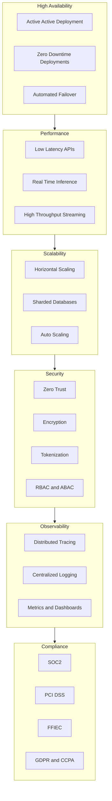

# Non-Functional Architecture for Banking Modernization

## 1. Introduction

This document defines the non-functional architecture (NFR blueprint) required to support high-scale, mission-critical banking workloads across Customer 360, Fraud and AML, Loan Origination, Real-Time Payments, and Core Banking.

The architecture ensures:
- High availability  
- Low latency  
- Scalability  
- Security  
- Observability  
- Regulatory compliance  

These NFRs apply across all domains in the modernization portfolio.

---

## 2. NFR Categories

### 2.1 Availability
- Target: **99.99% uptime** for real-time workloads  
- Active-active deployment across regions  
- Zero-downtime deployments  
- Automated failover and self-healing  

### 2.2 Performance
- Real-Time Payments: **< 2 seconds end-to-end**  
- Fraud scoring: **< 50 ms inference latency**  
- Customer 360 profile retrieval: **< 100 ms**  
- Loan decisioning: **< 1 second** for automated approvals  

### 2.3 Scalability
- Horizontal scaling for stateless services  
- Partitioned Kafka topics for high throughput  
- Sharded databases for large datasets  
- Auto-scaling for ML inference workloads  

### 2.4 Security
- Zero-trust architecture  
- Encryption in transit (TLS 1.2+)  
- Encryption at rest (AES-256)  
- Tokenization of PII  
- Fine-grained RBAC and ABAC  
- Continuous vulnerability scanning  

### 2.5 Reliability
- Circuit breakers  
- Retries with exponential backoff  
- Dead-letter queues  
- Event replay capability  
- Idempotent consumers  

### 2.6 Observability
- Distributed tracing (OpenTelemetry)  
- Centralized logging  
- Metrics (p95, p99 latency, throughput, error rates)  
- Domain-level dashboards  
- Real-time anomaly detection  

### 2.7 Compliance
- SOC 2  
- PCI DSS (for payments)  
- FFIEC guidelines  
- OCC 2011-12 model governance  
- GDPR/CCPA for data privacy  

---

## 3. High-Level NFR Architecture Diagram

---

## 4. Cross-Domain NFR Requirements

### 4.1 Real-Time Payments
- Sub-second fraud scoring  
- High-throughput event streaming  
- Strict SLA enforcement  
- Multi-region failover  

### 4.2 Fraud and AML
- Real-time inference  
- High-volume feature retrieval  
- Continuous model monitoring  
- Explainability for regulatory audits  

### 4.3 Loan Origination
- Consistent decisioning latency  
- Document processing throughput  
- High availability for underwriting workflows  

### 4.4 Customer 360
- Low-latency profile retrieval  
- Real-time updates from events  
- High read scalability  

---

## 5. Resilience Patterns

- Bulkheads  
- Circuit breakers  
- Timeouts  
- Retries  
- Load shedding  
- Graceful degradation  
- Event replay  

---

## 6. Data NFRs

### 6.1 Data Quality
- Schema validation  
- Drift detection  
- Outlier detection  

### 6.2 Data Governance
- Lineage tracking  
- Data cataloging  
- Access auditing  

### 6.3 Data Retention
- Domain-specific retention policies  
- Archival and purging workflows  

---

## 7. Summary

This non-functional architecture provides the foundation for a resilient, scalable, secure, and compliant banking modernization platform. It ensures that all domain services—Customer 360, Fraud and AML, Loan Origination, Real-Time Payments, and Core Banking—operate reliably under high load and strict regulatory requirements.

