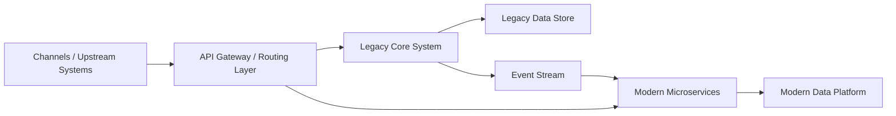

## Outline:
Problem: Legacy COBOL core

Architecture: API façade + event sourcing

Migration waves: Accounts → Payments → Loans

KPIs: Downtime reduction, release frequency

# Core Banking Strangler Pattern  
### Modernizing Legacy Core Systems Through Incremental, Low‑Risk Replacement

---

## 1. Introduction

The Strangler Pattern is a modernization approach that enables banks to gradually replace legacy core systems with modern, cloud‑native components.  
Instead of a risky “big‑bang” migration, the strangler pattern allows:

- Incremental modernization  
- Coexistence of old and new systems  
- Controlled migration of functionality  
- Reduced operational and regulatory risk  
- Faster delivery of new capabilities  

This pattern is widely used in banking due to the complexity, criticality, and regulatory constraints of core systems.

---

## 2. Why Banks Need the Strangler Pattern

Legacy core systems typically suffer from:

- Monolithic architecture  
- High technical debt  
- Limited scalability  
- Batch‑driven processing  
- Slow change cycles  
- Vendor lock‑in  
- High operational risk  

Replacing them outright is often:

- Too risky  
- Too expensive  
- Too slow  
- Too disruptive  

The strangler pattern provides a safe, controlled path to modernization.

---

## 3. Core Principles of the Strangler Pattern

### **3.1 Incremental Replacement**
Replace one domain or capability at a time.

### **3.2 Coexistence**
Legacy and modern components run in parallel.

### **3.3 Routing Layer**
A façade or API gateway routes traffic to old or new components.

### **3.4 Event‑Driven Integration**
New components consume events from legacy systems until fully migrated.

### **3.5 Domain‑Driven Decomposition**
Break the core into domains such as:

- Accounts  
- Payments  
- Loans  
- Customer  
- Ledger  
- Statements  

### **3.6 Zero‑Downtime Migration**
Cutover happens gradually, not all at once.

---

## 4. High‑Level Architecture Diagram

---

## 7. Modernization decision framework

To decide which domains to modernize first using the Strangler Pattern, we use a simple, repeatable scoring model:

- **Legacy Complexity Index (LCI)** – How hard is the legacy codebase to change?
- **Regulatory Criticality Score (RCS)** – How tightly is the domain tied to regulatory reporting/compliance?
- **Customer Impact Score (CIS)** – How visible is this domain to customers and channels?
- **Integration Density Score (IDS)** – How many upstream/downstream systems depend on this domain?
- **Data Entanglement Score (DES)** – How intertwined is the data model with other domains?

Each factor is scored from 1–10 and combined into a **Modernization Priority Score (MPS)**:

\[
MPS = 0.25 \cdot LCI + 0.25 \cdot CIS + 0.2 \cdot IDS + 0.2 \cdot DES + 0.1 \cdot RCS
\]

### Sample scoring

| Domain   | LCI | CIS | IDS | DES | RCS | MPS  | Priority |
|----------|-----|-----|-----|-----|-----|------|----------|
| Accounts | 8   | 9   | 8   | 7   | 7   | 8.0  | High     |
| Payments | 7   | 10  | 9   | 8   | 8   | 8.5  | Highest  |
| Loans    | 6   | 7   | 7   | 6   | 8   | 6.9  | Medium   |

This framework makes the modernization roadmap **transparent, defensible, and repeatable** across programs and regions.

## 8. Migration waves blueprint

The Strangler Pattern is executed in **controlled waves**, reducing risk while continuously delivering value.

### Wave 0 – Foundation and observability

- **API façade / gateway** in front of legacy core.
- **Centralized logging, tracing, and metrics** for both legacy and new services.
- **Feature flags** to control routing and cutover.

### Wave 1 – Read‑only services

- Introduce **read‑only microservices** for selected domains (e.g., account inquiry, transaction history).
- Route **GET** traffic through the façade to new services where available, otherwise to legacy.
- Validate **data parity** between legacy and new read models.

### Wave 2 – Write‑path migration

- Implement **create/update** flows in new domain services.
- Use **dual‑write with idempotency** or **event sourcing** to keep legacy and new stores in sync.
- Introduce **saga patterns** for multi‑step business processes.

### Wave 3 – Event‑driven cutover

- Shift from synchronous legacy calls to **event‑driven integration** (Kafka/Pulsar).
- Use **change data capture (CDC)** or domain events to propagate changes.
- Gradually **turn off legacy write paths** per capability.

### Wave 4 – Legacy decommissioning

- Disable remaining legacy endpoints for the migrated domain.
- Archive data according to **regulatory retention** requirements.
- Remove infrastructure and operational dependencies on the legacy stack.

This wave‑based approach allows banks to **strangle legacy safely**, while maintaining regulatory and operational continuity.

## 9. Architecture components

A typical core banking Strangler Pattern implementation includes the following components:

- **API Gateway / Façade** – Single entry point for channels; routes traffic to legacy or modern services.
- **Routing Layer** – Feature‑flag‑driven routing rules (per domain, per capability, per customer segment).
- **Anti‑corruption Layer (ACL)** – Translates legacy data models and protocols into clean domain models.
- **Domain Microservices** – Independently deployable services for Accounts, Payments, Loans, etc.
- **Event Bus** – Kafka/Pulsar for domain events, CDC streams, and asynchronous workflows.
- **CQRS Read Models** – Optimized read stores for high‑volume queries (e.g., balances, statements).
- **Legacy Adapter Services** – Thin wrappers around legacy APIs, queues, or batch interfaces.
- **Data Synchronization Layer** – Handles dual‑write, backfill, and reconciliation pipelines.

### High‑level flow (textual)

1. Channel calls **API Gateway**.
2. Gateway consults **routing rules** to decide between legacy and modern service.
3. For modernized capabilities:
   - Request goes to **domain microservice**.
   - Service publishes **domain events** to the **event bus**.
   - **Read models** and, where needed, **legacy adapters** consume events.
4. For non‑modernized capabilities:
   - Request is forwarded to **legacy adapter** and then to the core system.

This architecture allows **incremental replacement** of legacy capabilities without disrupting channels.

## 10. Anti‑patterns to avoid

Even with the Strangler Pattern, certain implementation choices can re‑introduce risk:

- **Big‑bang domain migration**  
  Migrating an entire domain in a single release, instead of capability‑by‑capability, increases failure blast radius.

- **Dual‑write without idempotency**  
  Writing to multiple systems without idempotent operations or deduplication leads to data corruption and reconciliation nightmares.

- **Rebuilding legacy logic 1:1**  
  Copying legacy code and flaws into new services defeats the purpose of modernization. Use the opportunity to **simplify and clarify** domain rules.

- **Ignoring data lineage and auditability**  
  In regulated environments, every transformation must be traceable. Lack of lineage breaks audit and regulatory reporting.

- **Tight coupling to legacy schemas**  
  Allowing legacy schemas to leak into new services creates a “distributed monolith” instead of a clean domain architecture.

Calling out these anti‑patterns explicitly helps teams **course‑correct early** in the program.

## 11. Data migration and reconciliation strategy

Data is often the highest‑risk aspect of core banking modernization. A robust strategy includes:

### Dual‑write and event sourcing

- New services **own the system of record** for migrated capabilities.
- Legacy is updated via:
  - **Domain events** (preferred), or
  - **CDC‑driven back‑propagation** from new stores.

### Backfill pipelines

- Historical data is migrated using **batch backfill jobs** or **streaming backfill**.
- Backfill is run **multiple times** (dry runs) before final cutover.

### Reconciliation

- Build **reconciliation dashboards** comparing:
  - Balances
  - Transaction counts
  - Key aggregates (per product, per segment, per day)
- Define **tolerance thresholds** and **automatic alerts** for mismatches.

### Cutover playbook

- Pre‑cutover:
  - Freeze selected changes if required.
  - Run final backfill and reconciliation.
- Cutover:
  - Switch routing for the capability to the new service.
  - Monitor KPIs and reconciliation metrics in real time.
- Post‑cutover:
  - Keep **read‑only access** to legacy for a defined period.
  - Decommission legacy paths once stability is proven.

This approach reduces the risk of **silent data drift** and supports regulatory scrutiny.

## 12. Regulatory and risk controls

Core banking modernization must be aligned with regulatory and risk expectations:

- **SOX and internal controls**  
  Ensure that new services and integration flows are covered by updated control libraries and evidence.

- **Data lineage and traceability**  
  Maintain end‑to‑end lineage from channel to core and reporting systems, including transformations and aggregations.

- **Auditability of dual systems**  
  During coexistence, both legacy and modern systems must be auditable, with clear ownership and reconciliation processes.

- **Customer impact mitigation**  
  Use **canary releases**, **limited cohorts**, and **feature flags** to control exposure during cutover.

- **Operational risk management**  
  Define clear **runbooks**, **incident response procedures**, and **rollback strategies** for each migration wave.

Embedding these controls into the design makes the Strangler Pattern **fit for regulated banking environments**.

## 13. KPIs and measurable outcomes

Typical KPIs to track the success of a Strangler‑based core modernization include:

- **Availability and downtime**
  - Planned downtime reduced from _X hours/month_ → **0 hours** for migrated capabilities.

- **Change velocity**
  - Release frequency improved from _monthly_ → **daily or weekly** for modern services.

- **Operational efficiency**
  - Batch processing window reduced by **Y%**.
  - Mean time to recovery (MTTR) reduced by **Z%**.

- **Customer experience**
  - Onboarding time reduced by **A%**.
  - Transaction response times improved by **B%**.

- **Incident profile**
  - Production incidents related to the migrated domain reduced by **C%**.

These KPIs can be tailored per bank, but the pattern is consistent: **more frequent, safer change with better customer outcomes**.

## 14. Testing and validation strategy

To safely strangle legacy in a core banking context, testing must go beyond unit and integration tests:

- **Parallel run / shadow mode**
  - Run new services in parallel with legacy, comparing outputs for the same inputs.

- **Golden dataset testing**
  - Use curated datasets with known expected results to validate complex business rules.

- **Contract testing**
  - Ensure that channel and partner integrations remain stable as services evolve.

- **Synthetic data generation**
  - Generate realistic but anonymized data for performance, chaos, and edge‑case testing.

- **Non‑functional testing**
  - Load, stress, resilience, and failover testing for each migration wave.

This strategy ensures that each cutover step is **evidence‑backed**, not just assumption‑driven.

