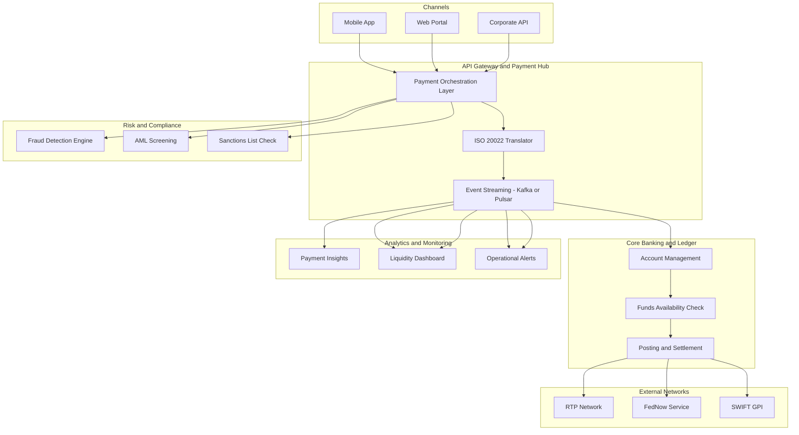

## Outline :
Problem: Legacy batch ACH systems

Target Architecture: ISO 20022, event-driven, 24x7 rails

Components: Fraud scoring, liquidity management, API gateway

KPIs: Settlement time, fraud reduction, STP rate

# Real‑Time Payments Modernization

## 1. Introduction

Real‑time payments (RTP) are transforming banking by enabling instant fund transfers, 24×7 availability, and richer data exchange. Traditional payment systems—ACH, wire, batch clearing—cannot meet modern expectations for speed, transparency, and ISO 20022 compliance.

Modernization requires an **event‑driven, API‑first, ISO 20022‑native architecture** that supports FedNow, RTP Network, and cross‑border instant payments. This document outlines a complete modernization blueprint for banks adopting real‑time payments.

---

## 2. Business Drivers

### 2.1 Customer Experience
- Instant settlement (<2 seconds)
- Real‑time notifications
- Improved transparency and traceability
- 24×7 availability

### 2.2 Regulatory & Compliance
- ISO 20022 migration
- FedNow participation requirements
- Enhanced sanctions screening
- Real‑time fraud monitoring

### 2.3 Operational Efficiency
- Reduced reconciliation time
- Automated exception handling
- Lower operational cost vs batch systems

### 2.4 Technology Evolution
- Cloud‑native payment hubs
- API‑based integration
- Event‑driven processing
- Real‑time analytics

### 2.5 Revenue & Innovation
- Request‑to‑Pay (R2P)
- Biller APIs
- Embedded payments
- Instant disbursements

---

## 3. Scope of Modernization

### 3.1 Payment Rails
- RTP Network
- FedNow Service
- ACH modernization
- Wire modernization
- SWIFT GPI for cross‑border

### 3.2 Data Standards
- ISO 20022 MX messages (pacs.008, pacs.009, camt.056)
- JSON APIs for internal orchestration

### 3.3 Integration Scope
- Core banking
- Fraud systems
- AML screening
- Customer 360
- Treasury & liquidity systems

### 3.4 Analytics Scope
- Real‑time liquidity monitoring
- Payment insights
- Operational dashboards

### 3.5 Operational Scope
- 24×7 support model
- Automated retries
- Real‑time alerts

---

## 4. Key Capabilities

- **Instant clearing & settlement**
- **ISO 20022 message processing**
- **Real‑time fraud & AML screening**
- **Event‑driven payment lifecycle**
- **API gateway for partners & fintechs**
- **Real‑time liquidity monitoring**
- **End‑to‑end traceability & audit logging**
- **High‑availability (99.99%) architecture**

---

## 5. Architecture Blueprint



## 6. Data Products

### 6.1 Payment Event Data Product
Captures all real‑time payment lifecycle events.

- PaymentInitiated
- PaymentValidated
- FundsChecked
- PaymentReleased
- PaymentSettled
- PaymentFailed
- PaymentReversed

**Attributes include:**
- Transaction ID  
- Sender and receiver IDs  
- Amount and currency  
- Timestamp  
- Channel  
- Status  

---

### 6.2 ISO 20022 Message Data Product
Stores normalized ISO 20022 messages for internal and external exchange.

- pacs 008 Credit Transfer
- pacs 009 FI Transfer
- camt 056 Payment Cancellation
- camt 029 Investigation Response

**Attributes include:**
- Message type  
- Message ID  
- Payload  
- Validation status  
- Transformation logs  

---

### 6.3 Fraud Signal Data Product
Real‑time risk signals used for fraud scoring.

- Velocity metrics  
- Device fingerprint  
- Behavioral anomalies  
- Geolocation mismatch  
- Historical risk score  

---

### 6.4 Liquidity Data Product
Supports treasury and intraday liquidity monitoring.

- Real‑time balances  
- Settlement positions  
- Liquidity usage  
- Threshold alerts  

---

### 6.5 Exception Data Product
Captures all failed or delayed transactions.

- Error code  
- Retry count  
- Network response  
- Root cause classification  

## 7. Real‑Time Decisioning and Risk Controls

### 7.1 Pre‑Transaction Checks
- Funds availability  
- Sanctions list screening  
- Customer risk profile  
- Device and behavioral checks  

### 7.2 In‑Flight Monitoring
- Velocity rules  
- Behavioral anomaly detection  
- Transaction pattern analysis  
- Cross‑channel correlation  

### 7.3 Post‑Transaction Analytics
- Fraud feedback loop  
- Model retraining  
- Exception analysis  
- Dispute and chargeback insights  

### 7.4 Latency Targets
- Risk evaluation under 100 ms  
- End‑to‑end processing under 2 seconds  

## 8. Integration with Fraud, AML and Customer 360

### 8.1 Fraud Integration
- Real‑time scoring  
- Device intelligence  
- Behavioral biometrics  
- Synthetic identity detection  

### 8.2 AML Integration
- KYC, CDD and EDD checks  
- Sanctions screening  
- Suspicious activity detection  
- Case management integration  

### 8.3 Customer 360 Integration
- Customer risk profile  
- Relationship insights  
- Payment behavior patterns  
- Real‑time updates to customer graph  

## 9. KPIs and Measurable Outcomes

### 9.1 Performance KPIs
- Average processing time under 2 seconds  
- 99.99 percent availability  
- ISO 20022 message success rate  

### 9.2 Risk and Compliance KPIs
- Fraud detection rate improvement  
- False positives reduction  
- Sanctions screening accuracy  

### 9.3 Operational KPIs
- Straight through processing rate above 95 percent  
- Exception resolution time reduction  
- Reconciliation time reduction  

### 9.4 Customer Experience KPIs
- NPS improvement  
- Notification delivery success  
- Payment completion rate  

## 10. Anti‑Patterns and Risks

### 10.1 Anti‑Patterns
- Treating real‑time payments as a batch extension  
- Hard‑coding ISO 20022 message formats  
- No real‑time fraud integration  
- No event replay capability  
- Siloed payment channels  

### 10.2 Risks
- Operational outages  
- Fraud spikes due to instant settlement  
- Liquidity shortages  
- Regulatory non‑compliance  

### 10.3 Mitigation Strategies
- Active‑active architecture  
- Real‑time fraud scoring  
- Liquidity monitoring  
- Automated failover  

## 11. Implementation Roadmap

### Phase 0 — Foundation
- API gateway  
- Event streaming  
- ISO 20022 translator  

### Phase 1 — Core Integration
- Ledger posting  
- Funds availability  
- Risk engine integration  

### Phase 2 — Network Connectivity
- RTP Network  
- FedNow Service  

### Phase 3 — Analytics and Monitoring
- Liquidity dashboard  
- Operational alerts  

### Phase 4 — Expansion
- Cross‑border real‑time payments  
- Embedded payments  
- Request to Pay  

## 12. Case Study (Anonymized)

A Tier 1 US bank modernized its payment hub to support FedNow and RTP Network.

### Outcomes
- 45 percent reduction in payment processing time  
- 60 percent drop in manual exceptions  
- 30 percent improvement in fraud detection accuracy  
- 99.99 percent availability achieved within six months


    Request to Pay                      :         p4c, 2025-02-01, 90d
```
