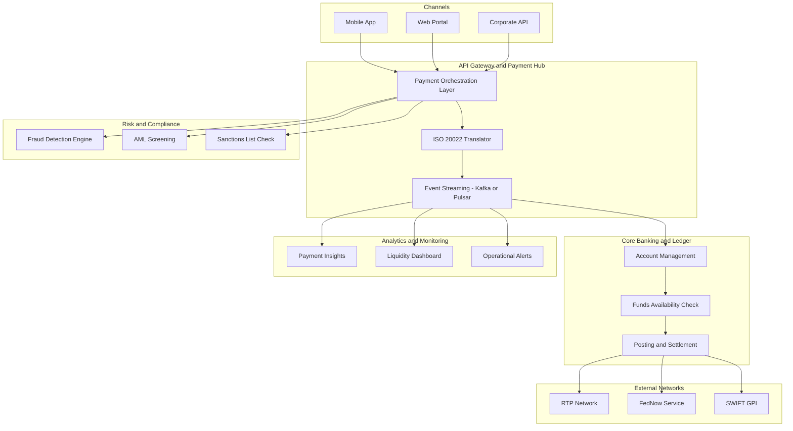

## Outline :
Problem: Legacy batch ACH systems

Target Architecture: ISO 20022, event-driven, 24x7 rails

Components: Fraud scoring, liquidity management, API gateway

KPIs: Settlement time, fraud reduction, STP rate

# Real‑Time Payments Modernization

## 1. Introduction

Real‑time payments (RTP) are transforming banking by enabling instant fund transfers, 24×7 availability, and richer data exchange. Traditional payment systems—ACH, wire, batch clearing—cannot meet modern expectations for speed, transparency, and ISO 20022 compliance.

Modernization requires an **event‑driven, API‑first, ISO 20022‑native architecture** that supports FedNow, RTP Network, and cross‑border instant payments. This document outlines a complete modernization blueprint for banks adopting real‑time payments.

---

## 2. Business Drivers

### 2.1 Customer Experience
- Instant settlement (<2 seconds)
- Real‑time notifications
- Improved transparency and traceability
- 24×7 availability

### 2.2 Regulatory & Compliance
- ISO 20022 migration
- FedNow participation requirements
- Enhanced sanctions screening
- Real‑time fraud monitoring

### 2.3 Operational Efficiency
- Reduced reconciliation time
- Automated exception handling
- Lower operational cost vs batch systems

### 2.4 Technology Evolution
- Cloud‑native payment hubs
- API‑based integration
- Event‑driven processing
- Real‑time analytics

### 2.5 Revenue & Innovation
- Request‑to‑Pay (R2P)
- Biller APIs
- Embedded payments
- Instant disbursements

---

## 3. Scope of Modernization

### 3.1 Payment Rails
- RTP Network
- FedNow Service
- ACH modernization
- Wire modernization
- SWIFT GPI for cross‑border

### 3.2 Data Standards
- ISO 20022 MX messages (pacs.008, pacs.009, camt.056)
- JSON APIs for internal orchestration

### 3.3 Integration Scope
- Core banking
- Fraud systems
- AML screening
- Customer 360
- Treasury & liquidity systems

### 3.4 Analytics Scope
- Real‑time liquidity monitoring
- Payment insights
- Operational dashboards

### 3.5 Operational Scope
- 24×7 support model
- Automated retries
- Real‑time alerts

---

## 4. Key Capabilities

- **Instant clearing & settlement**
- **ISO 20022 message processing**
- **Real‑time fraud & AML screening**
- **Event‑driven payment lifecycle**
- **API gateway for partners & fintechs**
- **Real‑time liquidity monitoring**
- **End‑to‑end traceability & audit logging**
- **High‑availability (99.99%) architecture**

---

## 5. Architecture Blueprint

    F --> Q
    F --> R
